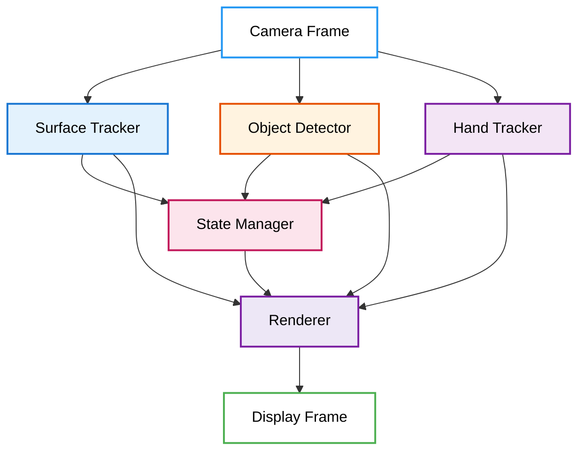
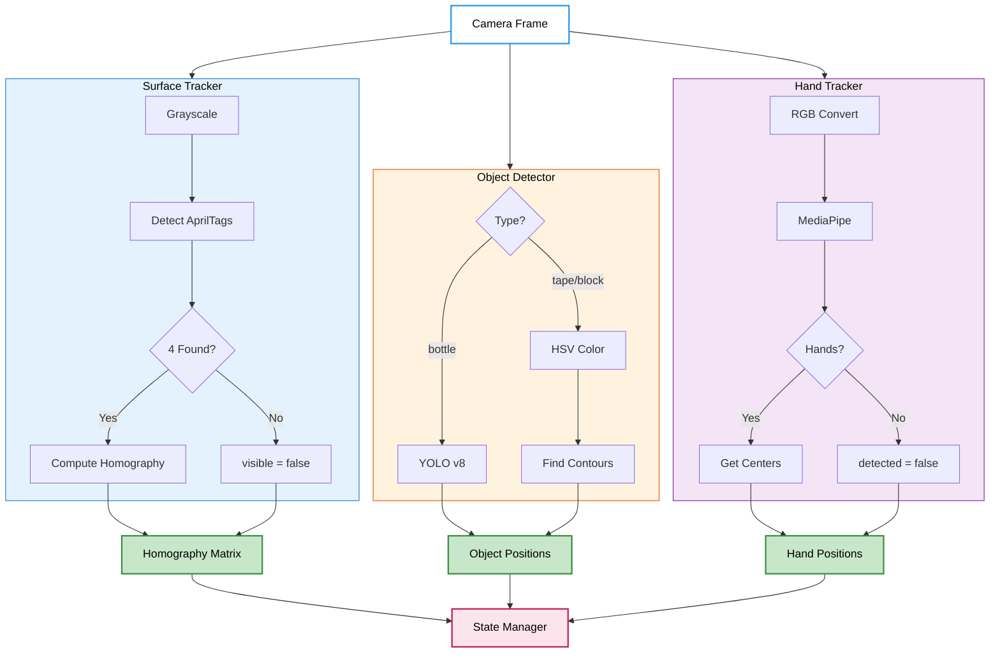
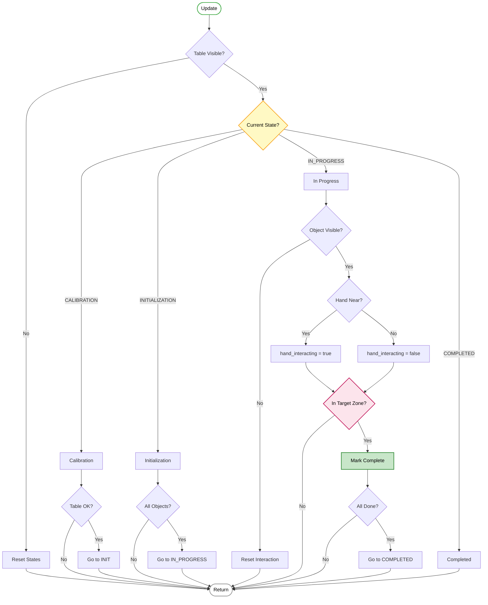
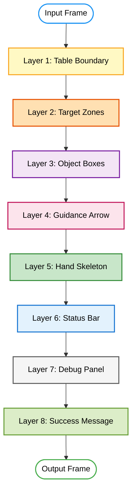
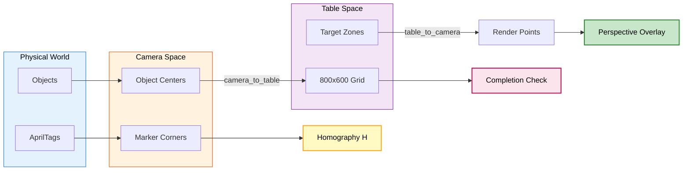
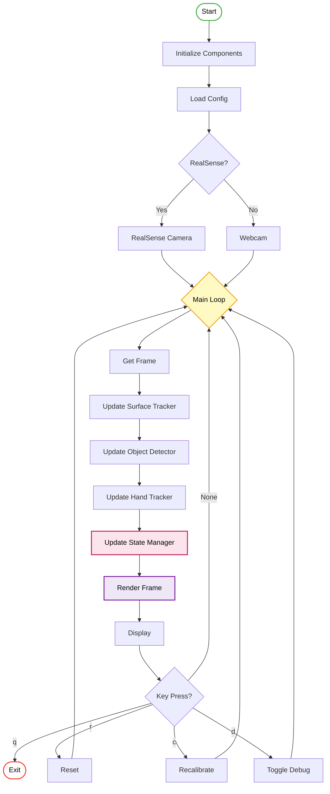

# Physical Task Guidance System - Table Organization

A real-time computer vision system that guides users through organizing objects on a table using augmented reality overlays, AprilTag surface tracking, and hybrid object detection.

## Project Overview

This system uses an Intel RealSense D435i camera to guide users through a 3-step table organization task. It detects a workspace defined by AprilTag markers, identifies objects (bottle, tape, block), and provides real-time visual guidance (arrows, target zones, progress feedback) to help users place each object in its designated location.

**Project**: #9 - Physical Task Guidance System (Option 2: Table Organization)

## System Architecture

The system is built with three core modules that communicate through well-defined interfaces:



### Module Communication
- **Perception → State Manager**: Object positions and hand tracking data flow to the state manager for logic updates
- **State Manager → Renderer**: Task progress, step info, and completion status flow to the renderer for visual feedback
- **Perception → Renderer**: Surface tracker provides coordinate transformations for perspective-correct rendering

## Features

### A. Perception Module
- **Surface/Table Tracking**: AprilTag markers (tag36h11, IDs 0-3) define the workspace boundary and compute a homography matrix for coordinate transformation between table space and camera space
- **Object Detection (Hybrid)**: YOLOv8 for common objects (bottle) + HSV color segmentation for custom objects (tape, blocks). Only objects inside the workspace boundary are tracked.
- **Hand Tracking (Bonus)**: MediaPipe Hands detects user hands and interaction with objects (confidence threshold: 0.3)



### B. State Management Module
- **Procedure Progress**: Tracks current step (1/3, 2/3, 3/3), step descriptions, and overall progress
- **Visibility**: Monitors table surface visibility and object positions within workspace boundary (using `cv2.pointPolygonTest`). Automatically updates to "not visible" when objects leave the workspace or are not detected.
- **Interaction Status**: Detects hand proximity to objects and object movement. Resets automatically when hands are not detected.
- **Completion Status**: Validates when objects are placed within target zones. Tracks per-step and overall procedure completion.



### C. Visualization & Interface
- **Workspace Boundary**: Yellow polygon drawn from AprilTag marker positions
- **Object Highlighting**: Green bounding boxes for detected objects, magenta for the current target object
- **Target Zones**: Perspective-corrected zones rendered via homography transformation (orange = incomplete, green = complete)
- **Guidance Arrows**: Magenta arrows from current object to its target location
- **Success Feedback**: "Great Job!" overlay appears at the target zone for 3 seconds upon step completion
- **Status Overlay**: Top bar with progress text and a progress bar showing completed steps
- **Debug Info**: Bottom-left panel showing real-time system state (State, Table, Object, Hand, Step)



### Coordinate Transformation

The system maps between two coordinate spaces using a homography matrix computed from the 4 AprilTag marker positions:
- **Table Coordinates** (800x600): Stable physical coordinates on the table surface, not affected by camera angle
- **Camera Coordinates**: Pixel coordinates in the camera frame



This enables perspective-correct rendering of target zones that align with the physical table surface regardless of camera position or angle.

## Main Loop



## Hardware Requirements

- Intel RealSense D435i camera (or compatible USB camera)
- 4 printed AprilTag markers (tag36h11 family, IDs 0, 1, 2, 3)
- Objects: bottle, masking tape, 3D-printed block (or similar colored objects)

## Installation

### 1. Clone the Repository
```bash
git clone <repository-url>
cd table_organization_guidance
```

### 2. Set Up Virtual Environment
A Python 3.12 virtual environment is required (MediaPipe 0.10.14 requires Python <= 3.12):
```bash
python3.12 -m venv .venv
source .venv/bin/activate
```

### 3. Install Dependencies
```bash
pip install -r requirements.txt
```

Dependencies:
| Package | Purpose |
|---------|---------|
| `opencv-contrib-python` | Computer vision, image processing |
| `numpy` | Array operations, coordinate math |
| `pyrealsense2` | Intel RealSense camera interface |
| `pupil-apriltags` | AprilTag detection (tag36h11 family) |
| `ultralytics` | YOLOv8 object detection (bottle) |
| `mediapipe` | Hand tracking (bonus feature) |

### 4. Prepare AprilTag Markers
- Download markers from: https://github.com/AprilRobotics/apriltag-imgs/tree/master/tag36h11
- Print markers: `tag36_11_00000.png` through `tag36_11_00003.png`
- Place at table corners:
  - **ID 0**: Top-left
  - **ID 1**: Top-right
  - **ID 2**: Bottom-right
  - **ID 3**: Bottom-left

## Running the System

### Quick Start
```bash
./run.sh
```

### Manual Start
```bash
source .venv/bin/activate
cd src
python main.py
```

### Keyboard Controls
| Key | Action |
|-----|--------|
| `q` | Quit the application |
| `r` | Reset the procedure (start over) |
| `c` | Recalibrate (re-detect markers) |
| `s` | Print full state status to console |

## Procedure Config

The task steps are defined in [`config/procedure_config.json`](config/procedure_config.json):

```json
{
  "procedure_name": "Table Organization - Object Placement",
  "steps": [
    {
      "object": "bottle",
      "target_position": [150, 100],
      "target_size": [100, 150],
      "description": "Move the Bottle to the upper left"
    },
    {
      "object": "tape",
      "target_position": [350, 200],
      "target_size": [120, 80],
      "description": "Move the Tape to the center"
    },
    {
      "object": "block",
      "target_position": [550, 150],
      "target_size": [100, 100],
      "description": "Move the Block to the right"
    }
  ],
  "markers": {
    "type": "apriltag",
    "family": "tag36h11",
    "ids": [0, 1, 2, 3]
  },
  "settings": {
    "completion_tolerance": 40,
    "hand_interaction_threshold": 100,
    "movement_threshold": 10
  }
}
```

Target positions, sizes, object names, and tolerance settings are all customizable through this config file.

## Task Workflow

1. **Calibration**: System starts with an empty table. All 4 AprilTag markers must be visible to detect the workspace boundary.

2. **Initialization**: 3 target zones are generated on the table. The user places the objects (bottle, tape, block) randomly on the table.

3. **Task 1 (Bottle)**: System highlights the bottle with a magenta bounding box and draws a guidance arrow pointing to Target Location A. Once the bottle is within the target zone, the zone turns green and "Great Job!" is displayed near the target area for 3 seconds.

4. **Task 2 (Tape)**: System highlights the tape and draws an arrow to Target Location B. Zone turns green and "Great Job!" displays when tape is placed correctly.

5. **Task 3 (Block)**: System highlights the block and draws an arrow to Target Location C. Zone turns green and "Great Job!" displays when block is placed correctly.

6. **Completion**: Once all items are placed, the system displays "Table Set Successfully!" with a full progress bar.

## Color Calibration

If tape or blocks aren't being detected correctly, use the color calibration utility:

```bash
source .venv/bin/activate
cd src
python calibrate_hybrid_colors.py
```

- Press `1`/`2` to select tape or block
- Click on the object multiple times (5-10 points)
- Press `SPACE` to apply calibration
- Press `S` to output the calibrated color ranges (copy into `main.py`)

## Project Structure

```
table_organization_guidance/
├── README.md                          # This documentation
├── requirements.txt                   # Python dependencies
├── run.sh                             # Convenience run script (activates venv)
├── config/
│   └── procedure_config.json          # Task step definitions and settings
└── src/
    ├── main.py                        # Main application entry point
    ├── calibrate_hybrid_colors.py     # Color calibration utility for tape/block
    ├── yolov8n.pt                     # YOLOv8 nano model weights
    ├── perception/                    # Perception Module
    │   ├── surface_tracker.py         # AprilTag detection and homography transformation
    │   ├── hybrid_detector.py         # Hybrid detector combining YOLO + color-based detection
    │   ├── object_detector.py         # Color-based object detection (HSV segmentation)
    │   └── hand_tracker.py            # MediaPipe hand tracking
    ├── state_manager/                 # State Management Module
    │   └── state_manager.py           # Procedure logic, step tracking, workspace boundary checks
    └── visualization/                 # Visualization Module
        └── renderer.py                # All visual overlays, target zones, arrows, status, debug info
```

## Robustness

The system handles common failure cases gracefully without crashing:
- **Object occlusion**: If an object briefly disappears or is occluded, the system continues and automatically updates visibility state to "Not Visible"
- **Marker loss**: If AprilTag markers are temporarily occluded, the system falls back to calibration mode and recovers when markers reappear
- **Hand tracking**: Optional module - system works fully without hands detected; interaction states reset automatically
- **Workspace filtering**: Only objects within the AprilTag boundary are tracked, preventing false detections outside the workspace
- **State resets**: When objects leave the workspace or hands are removed, interaction and movement states reset automatically

## Troubleshooting

| Issue | Solution |
|-------|----------|
| Markers not detected | Ensure all 4 markers visible, check lighting, make markers larger |
| Objects not detected | Run `calibrate_hybrid_colors.py` to tune color ranges for your objects |
| Hand tracking not working | Ensure MediaPipe is installed, check lighting conditions |
| MediaPipe import error | Use the `.venv` virtual environment (Python 3.12 required) |

## Demo Video

A demo video is included showing the complete workflow: calibration, object placement, guided organization through all 3 steps, "Great Job!" feedback, and final completion screen.
